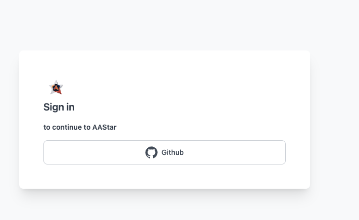

# Dashboard
DashBoard is your gateway to access our services such us paymaster,Airaccount, And monitor your product


We will provide a open-source framework to run your own gas sponsor service with one-key deployment.
Dashboard is one of the important components for data visualization.


## Fow who?

We have different terminals which service for different target users.
Now we open dashboard for individual sponsors, we will open dashboard for terminal users and project runners and more later.

### Individual Sponsor

As a individual sponsor, you will run a signature service at a relay server based on our ETHPaymaster framework.
Any developers want a gas sponsorship service, just send their UserOps to your API.

#### API management

##### Apply

Access this URL: [Get API key ](https://ethpaymaster.org/dash/apikey)

1. Input your Email, project website and  daily user transaction number
2. need attachment to verify, like snapshot, contract address in EtherScan), submit the form.
3. The maintainer will check and give a manually or automatically answer.
4. You will get a key like this in your Email:

```md
Access key: 30f60d8f-cb72-4cf1-ab72-eccaa5142c68

```


# Login
The Dashboard can be found in  https://dashboard.aastar.io/. Serval sign in options are Avaliable including Gihub,..



# Apply And Config Your APIKey


# Monitor Your Service


# Config your Sponsor Strateies And Deposit Your Tank

