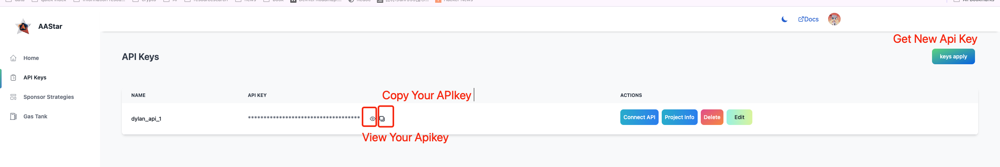
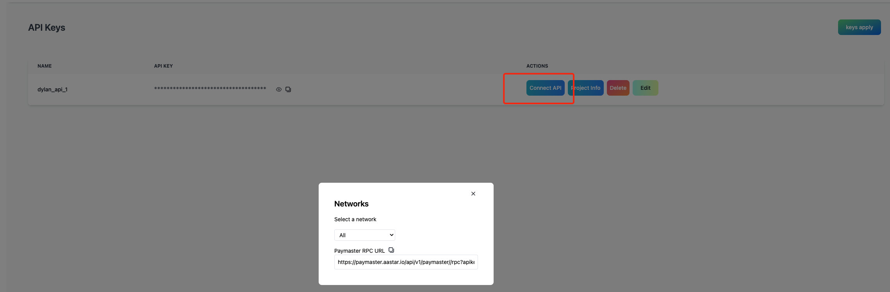
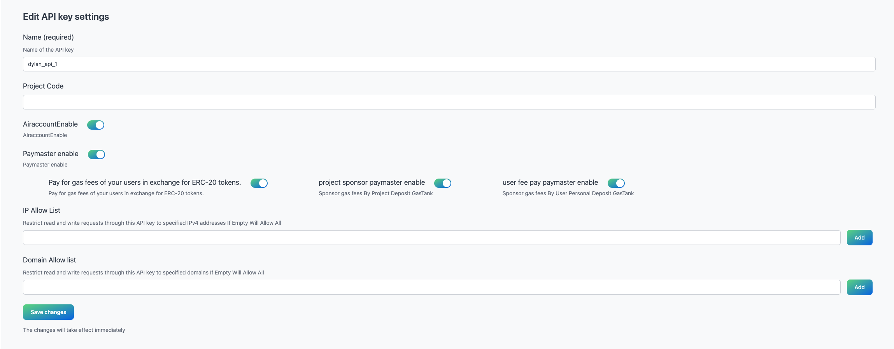

# API KEY

Enter the API key list, where you can check all your API keys, obtain information about the API key, and view or copy your API key.

At the same time, get the RPC URL corresponding to your API key under various networks and services.

You can configure detailed information for your API key and set some restrictions such as whitelisting IP addresses and domains, allowing paymasters or airaccounts.

