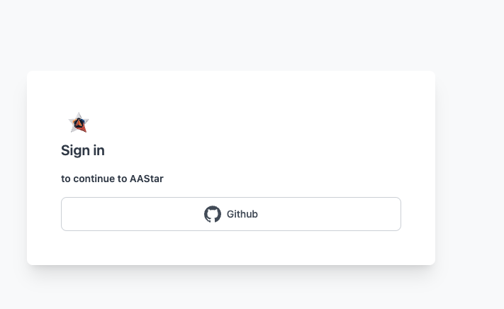

---
---
# Dashboard
The dashboard is where you can view your API keys for our services (such as Paymaster, Airaccount), monitor product entrances, and recharge your Paymaster balance to sponsor transactions.

# Login
You can find the dashboard at https://dashboard.aastar.io/. Various login options are available including GitHub. 

On the homepage, you can check your interface overview data and API overview information. Click on the API ViewMetric button to query detailed status and monitoring of the current API.

In the following sections, we will introduce the following concepts more systematically:

::: tip
Apply for an API Key and obtain URLs for services you need (Paymaster, Airaccount) [source](api_key.md)
:::
::: tip
Recharge your Paymaster account and configure your sponsorship strategy [source](sponsor_strategy.md)
:::