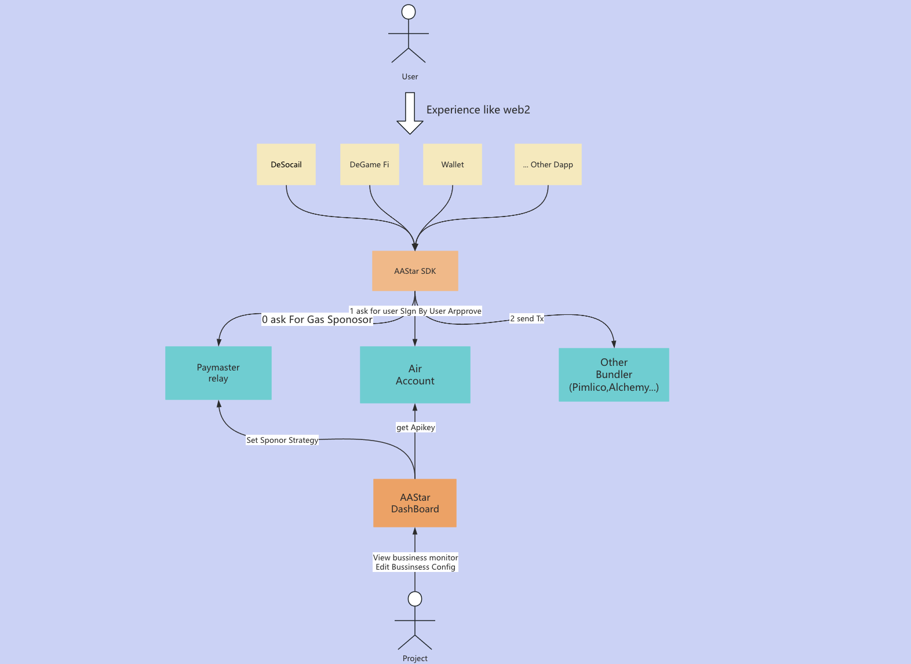

AA Star is a community dedicated to the Ethereum account abstraction infrastructure for large-scale user adoption. We provide open-source components and a complete framework for end-users, project initiators, and ecosystem partners.

For an introduction to AA, please refer to [aa_intro](aa_intro.md).

Through infrastructure such as SDK, Paymaster, Airaccount, and ConmetEns, we offer developers a one-stop interaction infrastructure for AA. This helps our developers quickly and conveniently utilize AA and its extension capabilities while providing our regular users with the same interactive experience as web2.

Developers can input transaction basic information such as interaction contracts and contract parameters through the SDK, along with necessary verification authorization parameters to initiate transactions. The SDK assists in managing different paymasters' details across various bundlers on different chains so that developers do not need to worry about the detailed technical aspects of AA or different chains; they only need to read our documentation for development.

The following is our architecture diagram: The SDK connects bundlers from different vendors via our airaccount service which manages user accounts. It obtains user authorization signatures and helps concatenate the necessary parameters for initiating AA transactions before forwarding them to Bundler for on-chain interactions.

SDK internal interaction process:
1. Based on the developer's transaction information, apply to paymaster for gas payment for this transaction.
2. Verify the information through a third-party platform (such as Google) or facial recognition, and apply to airaccount for user signature authorization for aa transaction.
3. After assembling the information, send a request to Bundler (the corresponding Bundler provider enumeration needs to be specified by the user) to initiate an aa transaction.

AA Star currently has four core services:
* Paymaster [Details](../paymaster/overview.md): Provides users with gas payment support including gas prepayment cards, Erc20 payments Gas diverse gas payment support services
* Airaccount [Details](../airaccount/overview.md): Provides users with comprehensive security decentralized account management services across chains allowing users to use biometric information such as fingerprints facial recognition or other third parties like Google authentication manage user accounts and assets,
* Comet Ens [Details](../ens/overview.md)
* DashBoard [Details](../dashboard/overview.md): Helps developers apply for Apikey configure business strategies of services like Paymaster Airaccount observe their own business data