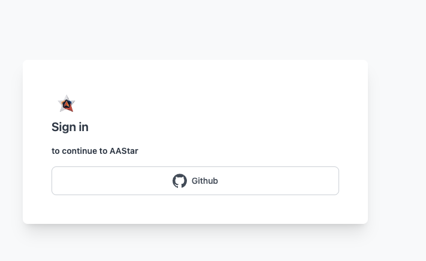
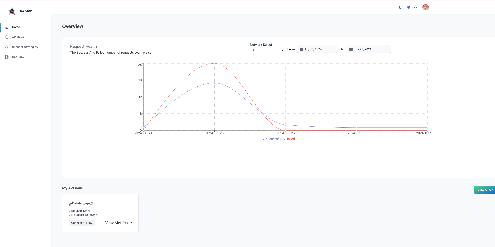
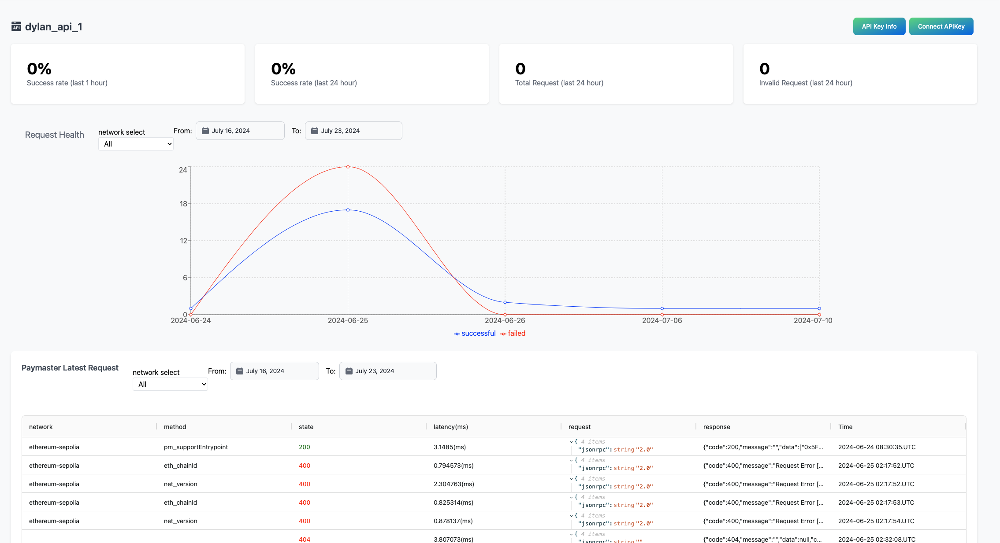

---
---
# 仪表板
仪表板是您我们的服务（如支付主管、Airaccount） 查看你的API 密钥，以及监控产品的入口，此外您可以在这里充值您的Paymaster额度以赞助交易

# 登录
可以在 https://dashboard.aastar.io/ 找到仪表板。包括GitHub等多种登录选项可用。。

在主页中您可以查询您的接口概览数据信息，和API概览信息，点击API ViewMetric 按钮 查询当前API的详细状态和监控

在以下各节中，我们将更系统地介绍以下概念：

::: tip
申请 APIKey 并获取您需要的服务（paymaster，airaccount，）的URL [source](api_key.md)
:::
::: tip
充值你的Paymaster 由箱 并配置您的赞助策略 [source](sponsor_strategy.md)
:::
