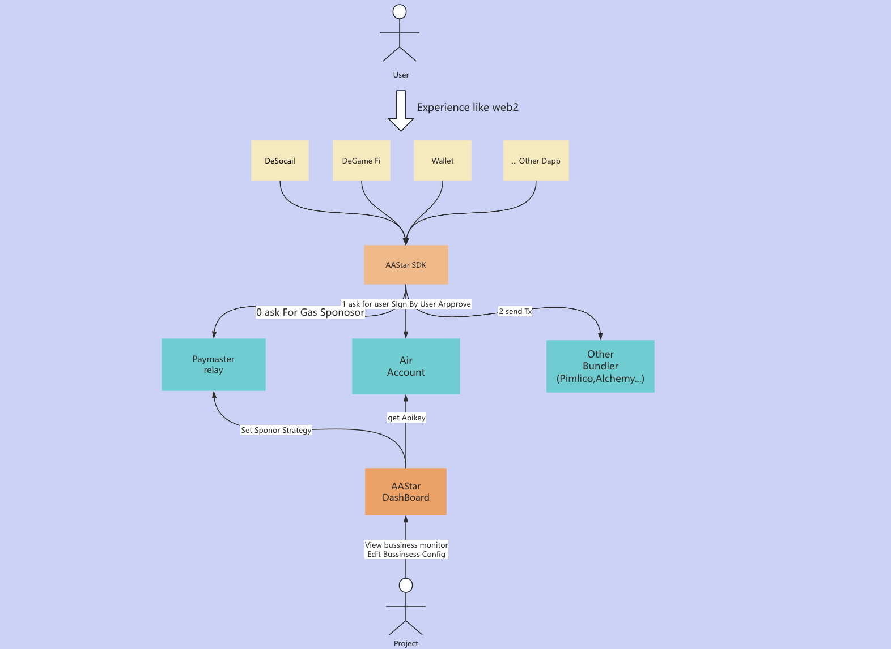

AA Star 是一个 致力于用户大规模采用的以太坊账户抽象基础设施的社区，我们为最终用户、项目发起者和生态系统合作伙伴提供开源组件和完整框架。

关于 AA的介绍 请查看 [aa介绍](aa_intro.md)

我们通过 Sdk，Paymaster， Airaccount，ConmetEns 这些基础设施，为开发者提供一站式的aa 交互基础设施，帮助我们的开发者快速便捷的使用aa及其扩展能力，为我们的普通用户提供和web2 一样的交互体验。

开发者通过 SDK 输入交易基础信息 如交互合约和合约参数，以及必要的验证授权参数，即可发起交易，SDK帮助管理不同paymaster不同 bundler 不同链的开发细节，开发者不需要在意aa和不同链的详细技术细节 只需要阅读我们的文档即可进行开发。

以下这是我们的架构图，SDK 串联起 不同厂商的Bundler，Paymaster，通过我们的airaccount 这个管理用户账户的服务 获取用户授权签名，sdk会帮你拼接好发起aa 交易需要的参数，转发给Bundler发起aa链上交互

SDK 内部交互流程：
1. 基于开发者的交易信息 向paymaster 申请此次交易gas的代付
2. 通过 第三方平台（如谷歌）或者面部识别验证信息 向airaccount申请 aa交易的用户签名授权
3. 组装好 信息后，发送请求给Bundler（需要用户指定 对应的Bundler提供商枚举）发起aa交易

AA Star目前有四个核心服务
* Paymaster  [详情](../paymaster/overview.md) : 为用户提供gas代付 加油卡付款，Erc20付款Gas 的多样化gas代付支持的服务
* Airaccount [详情](../airaccount/overview.md): 跨链为用户提供完善 安全 去中心化的账户管理服务，让用户使用生物信息 如指纹 面部 验证或者其他第三方如谷歌 验证管理用户的账户和资产，
* Comet Ens   [详情](../ens/overview.md)
* DashBoard [详情](../dashboard/overview.md) ： 帮助开发者申请Apikey，配置服务的如Paymaster， Airaccount的业务策略， 观察自己的业务数据

